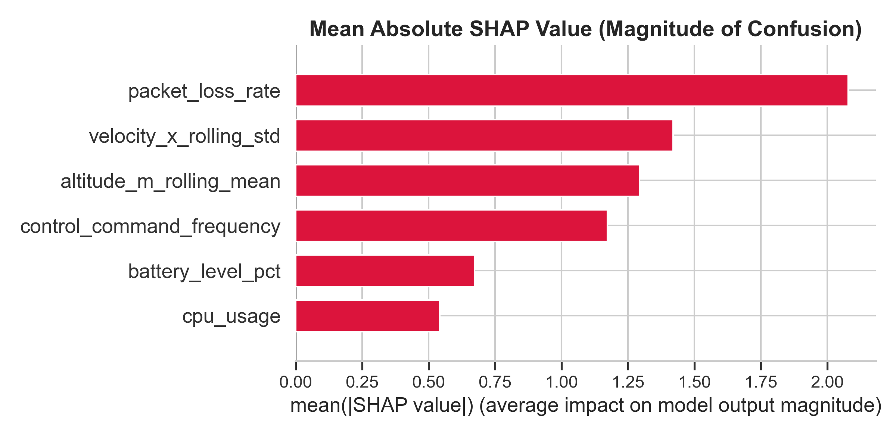

# Unsupervised Meta-Ensembles for Autonomous UAVs: A Dual-Sensor Approach to Cyber-Physical Anomaly Detection


> **Key Achievement:** By implementing a fault-tolerant Majority-Vote Meta-Ensemble across 195 cyber-physical dimensions, this architecture distilled over 450 baseline statistical anomalies down to 55 high-confidence events. This represents an 88% reduction in systemic noise, demonstrating the framework's capability to isolate complex, multi-vector structural deviations without relying on predefined historical signatures.


*Figure: SHAP Feature Explainability highlighting the drivers of cyber-physical boundary errors.*

---

## 1. Problem Formulation & Significance
Drone fleets operate in complex, hostile environments where relying on predefined threat signatures (malware hashes, static threshold alerts) is fundamentally insufficient. Latent hardware degradation and zero-day cyber attacks (Command & Control hijacking, GPS spoofing, DDoS) rarely trigger single-metric alarms. 

**The Mission:** To engineer a dual-sensor, unsupervised machine learning architecture capable of independently monitoring physical kinematics and network health, flagging the top 5% most abnormal, multi-vector events for human review.

## 2. Core Hypotheses & Methodology
1. **The Kinematic Hypothesis:** Unsupervised anomaly detection on multi-variate telemetry can isolate physical failures undetectable by static alerts.
2. **The Cyber Hypothesis:** Latent cyber threats manifest as sustained statistical outliers in network logs without requiring predefined signatures.
3. **The Temporal State Hypothesis:** UAV failures are sustained events. Incorporating 5-hour rolling windows and lag variables yields higher-fidelity anomaly boundaries than point-in-time analysis.

## 3. Project Architecture & MLOps
This repository demonstrates full-lifecycle MLOps maturity:
* **`DVC` (Data Version Control):** Tracks multi-gigabyte matrix transformations and model artifacts without polluting Git history.
* **`MLflow`:** Centralized logging engine for hyperparameter tracking, experiment comparison, and model registry.
* **`Optuna`:** Automated Bayesian optimization used to maximize the unsupervised decision boundary gap.
* **`Evidently AI`:** Automated data drift monitoring evaluating 189 dimensions to ensure long-term operational stability.

## 4. Model Card
Following a 6-experiment evaluation phase (including PCA+LOF, One-Class SVMs, and K-Means Hybrids), a finalized champion model was selected to combat Euclidean magnitude bias and the curse of dimensionality.

* **Base Architecture:** Temporally-Shifted Isolation Forest (Optimized via Optuna)
* **Final Deployment:** Majority-Vote Meta-Ensemble (Intersection of Tree, Boundary, and Density models)
* **Dimensionality:** 195 engineered features (Dual-Sensor Fusion)
* **Contamination Rate:** 0.05 (Top 5% Anomaly Isolation)
* **Explainability:** Integrated **SHAP** (SHapley Additive exPlanations) to crack the black-box boundaries and explicitly map spatial vulnerabilities (packet loss vs. battery drain).

### The Ablation Proof
Ablation study confirmed that removing the temporal rolling windows or decoupling the cyber/kinematic sensors resulted in severe blind spots to complex, multi-vector attacks, explicitly proving the necessity of the 195-dimensional matrix.

---

## 5. Repository Structure

```text
├── data/                  # DVC-tracked datasets (Raw & Engineered)
├── notebooks/             # Jupyter notebooks for EDA and initial prototyping
├── src/                   # Production Python scripts (training, evaluation, pipeline)
├── plots/                 # Web-optimized diagnostic visualizations and SHAP plots
├── config/                # JSON configuration files for experiments
├── mlruns/                # MLflow tracking database
├── requirements.txt       # Project dependencies
└── README.md              # Project documentation
```

## 5. Execution Guide
To reproduce the experimental pipeline:
1. Install dependencies
`pip install -r requirements.txt`

2. Pull datasets via DVC
`dvc pull` 

3. Feature Engineering
`python src/features.py`

4. Experiments
`python src/train.py config/exp1_baseline.json` (Iterate 1-6)

5. Evaluations
`python src/evaluate.py data/exp5_predictions.csv`

6. Visualizations
`python src/visualize.py data/exp1_predictions.csv Exp1_IsolationForest` (Iterate 1-6)

7. Optimization
`python src/optimize.py`

8. Ablation Study
`python src/ablation.py`

9. Monitoring with Evidently AI
`python src/evidently_report.py`

10. Error analysis
`python src/error_analysis.py`

11. MLflow Dashboard
`mlflow ui --backend-store-uri sqlite:///mlruns/mlflow.db`
